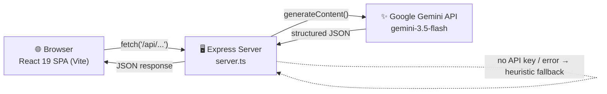
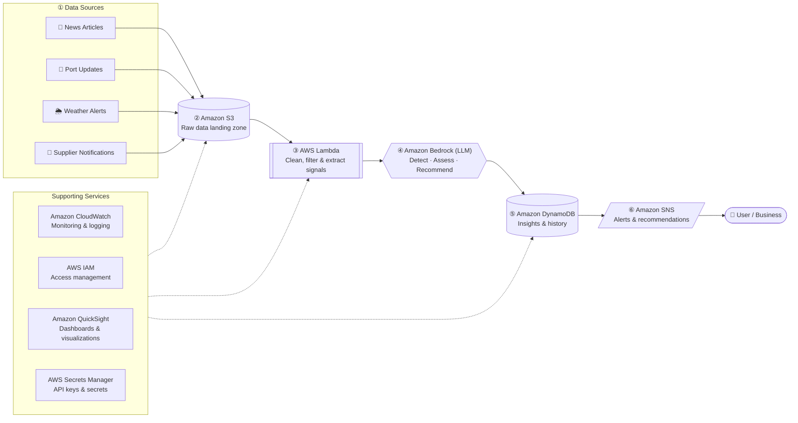
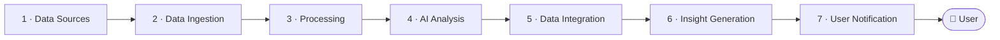
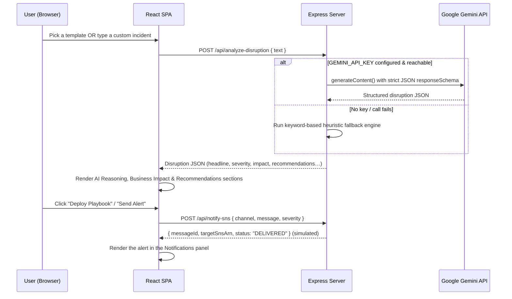

<div align="center">

<!-- ============================= BANNER ============================= -->
<!-- TODO: Replace with your real banner — recommended size 1280×360px, saved at assets/banner.png -->


<br/>

<!-- ============================= LOGO ============================= -->
<!-- TODO: Replace with your real logo — recommended size 180×180px, saved at assets/logo.png -->


# SentinelChain AI

### AI-Powered Supply Chain Intelligence — Detect disruptions early, assess their impact, and act before they cost you.

<br/>

<!-- ============================= BADGES ============================= -->


[**🚀 Live Demo**](https://sentinel-chain-ai.vercel.app/) · [**📓 Build Log (Medium)**](https://medium.com/@shambhavi117btit25/week-2-part-2-once-the-idea-was-clear-everything-else-started-falling-into-place-2deb2e914950) · [**🐛 Report a Bug**](https://github.com/mysterio-Apoorva/SentinelChain-AI/issues) · [**✨ Request a Feature**](https://github.com/mysterio-Apoorva/SentinelChain-AI/issues)

</div>

---

> **🧭 A note on honesty.** This README intentionally separates **what is implemented today** from **the production architecture this project is designed around**. SentinelChain AI's UI is built to look and feel like a live AWS Bedrock pipeline — because that's the vision the team designed on a whiteboard first. Under the hood right now, AI inference runs on the **Google Gemini API**, the "AWS Pipeline" you see animate is an **interactive visualization**, and services like SNS notifications and CloudWatch-style metrics are **simulated** so the demo always works, with or without cloud credentials. Every section below is labeled ✅ **Live**, 🟡 **Simulated**, or 🧭 **Target / Roadmap** so nothing is ever oversold.

<br/>

## <a name="toc"></a>📑 Table of Contents

- [Demo](#demo)
- [Screenshots](#screenshots)
- [Problem Statement](#problem-statement)
- [Why This Project Exists](#why-this-exists)
- [Our Solution](#solution)
- [Features](#features)
- [Tech Stack](#tech-stack)
- [System Architecture](#system-architecture)
- [Target AWS Architecture](#aws-architecture)
- [Workflow — Request Lifecycle](#workflow)
- [Folder Structure](#folder-structure)
- [Installation](#installation)
- [Environment Variables](#environment-variables)
- [Usage](#usage)
- [API Documentation](#api-documentation)
- [AI Pipeline](#ai-pipeline)
- [Cloud Infrastructure](#cloud-infrastructure)
- [Security](#security)
- [Challenges Faced](#challenges-faced)
- [Design Decisions](#design-decisions)
- [Future Improvements](#future-improvements)
- [Performance](#performance)
- [Contributors](#contributors)
- [License](#license)
- [Acknowledgements](#acknowledgements)

---

## <a name="demo"></a>🎬 Demo

<div align="center">

**[👉 Try the live demo here](https://sentinel-chain-ai.vercel.app/)**

<!-- TODO: Replace with a real product walkthrough GIF, saved at assets/demo.gif -->


</div>

Tip: once the app is open, press **`` ` ``** (backtick) or **Ctrl + T** to open the live **Operations Diagnostics Console**.

---

## <a name="screenshots"></a>🖼️ Screenshots

<!-- TODO: Replace every cell below with a real screenshot saved under assets/screenshots/ -->
<table>
  <tr>
    <td width="50%" align="center">
      
      <br/><sub><b>Global Intelligence</b> — hero, live risk KPIs & hotspot ticker</sub>
    </td>
    <td width="50%" align="center">
      
      <br/><sub><b>Global Monitoring</b> — simulated multi-source ingestion stream</sub>
    </td>
  </tr>
  <tr>
    <td width="50%" align="center">
      
      <br/><sub><b>Incoming Disruptions</b> — scenario templates & custom intel input</sub>
    </td>
    <td width="50%" align="center">
      
      <br/><sub><b>Pipeline Visualizer</b> — animated S3 → Lambda → Bedrock → DynamoDB → SNS</sub>
    </td>
  </tr>
  <tr>
    <td width="50%" align="center">
      
      <br/><sub><b>AI Reasoning</b> — tokenization, entity mapping & inference trace</sub>
    </td>
    <td width="50%" align="center">
      
      <br/><sub><b>Recommendations</b> — mitigation playbooks with cost/impact</sub>
    </td>
  </tr>
</table>

---

## <a name="problem-statement"></a>🧩 Problem Statement

Global supply chains are hit constantly by port congestion, extreme weather, geopolitical disruptions, labor strikes, and supplier failures. Most monitoring today is **reactive** — teams find out about a disruption only after a shipment is already late or a supplier has already missed a deadline. That reactive posture leads to:

- 📉 Inventory shortages and missed SLAs
- 💸 Emergency, high-cost mitigation (air-freight, last-minute rerouting)
- 🐢 Slow, manual decision-making during high-pressure incidents
- 🔍 Poor visibility into *why* a disruption matters to a specific business

## <a name="why-this-exists"></a>💡 Why This Project Exists

While designing SentinelChain AI, **Team Future Foundry** deliberately avoided picking cloud services first. Instead, the team mapped the full information journey on a whiteboard — from a single raw signal (e.g. *"a news article reporting a port strike"*) all the way to a notified, informed user — before writing a line of code or choosing a single AWS service. The goal was a system where **every component has a clear reason to exist**, rather than a stack assembled because the services were available.

That whiteboard-first thinking is captured directly in this repository's design docs (see [System Architecture](#system-architecture) and [Target AWS Architecture](#aws-architecture) below).

## <a name="solution"></a>🛠️ Our Solution

SentinelChain AI continuously imagines a pipeline that:

1. **Detects** potential disruptions from news, weather, port, and supplier signals
2. **Understands** them using an LLM-driven reasoning layer
3. **Assesses impact** on inventory, deliveries, and cost
4. **Recommends** concrete, costed mitigation playbooks
5. **Notifies** the right stakeholders before the disruption becomes a crisis

The current build is a fully interactive, end-to-end **demo of that pipeline**: you can submit a real (or templated) disruption report, get a genuine AI-generated structured risk assessment back, watch it animate through the architecture, inspect the model's reasoning, review costed playbooks, and "dispatch" an alert — all in one cinematic single-page experience.

---

## <a name="features"></a>✨ Features

| Feature | Description | Status |
|---|---|---|
| **AI-Powered Disruption Analysis** | Sends a raw incident report to the Google Gemini API (`gemini-3.5-flash`) with a strict JSON response schema, returning headline, category, severity, probability, affected nodes, inventory/cost impact, reasoning steps & recommendations | ✅ Live |
| **Graceful Offline Fallback** | If `GEMINI_API_KEY` isn't set, or the live call fails, a deterministic keyword-based heuristic engine (Suez/canal, typhoon/storm, strike/labor, chip/supplier, etc.) returns a realistic analysis so the demo never breaks | ✅ Live |
| **Curated Scenario Templates** | Four ready-made incidents (Suez Canal blockage, Typhoon In-Fa, LA/Long Beach port strike, semiconductor shortage) for one-click analysis | ✅ Live |
| **Custom Incident Console** | Free-text input to analyze *any* custom supply-chain disruption scenario | ✅ Live |
| **Animated Pipeline Visualizer** | Interactive node diagram (Sources → S3 → Lambda → Bedrock → DynamoDB → SNS) that animates step-by-step in sync with each analysis request | 🟡 Simulated |
| **AI Reasoning Inspector** | Step-by-step visual breakdown of tokenization, entity mapping, inference, and JSON compilation for the active disruption | 🟡 Simulated |
| **Business Impact Charts** | Hand-rolled SVG charts modeling 15-day inventory drawdown and logistics cost surge for the active disruption | ✅ Live |
| **Mitigation Playbooks** | AI-generated, costed mitigation actions with a risk-reduction percentage; can be "deployed" from the UI | ✅ Live |
| **Notification Center** | Dispatches an alert to a channel (Slack / SMS / Email / PagerDuty) via `/api/notify-sns`, which returns a synthetic message ID and ARN | 🟡 Simulated |
| **Live Global Monitoring Feed** | Auto-refreshing ticker of simulated news / weather / port / supplier signals | 🟡 Simulated |
| **Operations Diagnostics Console** | Toggle with `` ` `` or `Ctrl+T`; polls `/api/performance-metrics` for real server stats blended with illustrative AWS-style telemetry | 🟡 Simulated |
| **Role-Based View Switcher** | Switch between four IAM-style personas (Solutions Architect, Logistics Officer, Security Auditor, Systems Admin) | 🟡 UI-only — no real authentication or access control |
| **Animated Canvas Background** | Canvas-rendered global network of nodes, shipping routes & orbiting satellites | ✅ Live |

---

## <a name="tech-stack"></a>🧰 Tech Stack

| Category | Technologies |
|---|---|
| **Frontend** | React 19, TypeScript, Vite 6, Tailwind CSS v4, [Motion](https://motion.dev/) (animation), Lucide React (icons) |
| **Backend** | Node.js, Express 4, `tsx` (dev runtime), `esbuild` (production bundling) |
| **Database** | None currently — all analysis state lives in React component state and resets on refresh. Amazon DynamoDB is part of the [Target AWS Architecture](#aws-architecture), not yet implemented |
| **AI** | Google Gemini API (`@google/genai` SDK), structured output via `responseSchema` |
| **Cloud / Deployment** | [Vercel](https://vercel.com/) (hosts the public live demo); scaffolded with [Google AI Studio](https://aistudio.google.com/) build conventions (`metadata.json`, Cloud-Run-style `APP_URL` injection) |
| **Dev Tools** | npm, Git, `dotenv`, TypeScript compiler (`tsc --noEmit`) |
| **Testing** | Not yet implemented — see [Future Improvements](#future-improvements) |
| **Monitoring** | In-app diagnostics console only (`/api/performance-metrics`); no external APM/observability tool is wired in today |

---

## <a name="system-architecture"></a>🏗️ System Architecture

The product is designed around a simple five-stage mental model — captured on the team's whiteboard before any code was written:


In the **current implementation**, this mental model maps onto a conventional two-tier web app:



There is currently **no separate database tier, message queue, or cloud function layer** — the Express server does ingestion, "processing," AI orchestration, and response shaping all in one process, deployed as a single service on Vercel.

---

## <a name="aws-architecture"></a>☁️ Target AWS Architecture <sub>(Vision / Roadmap — not yet provisioned)</sub>

> This is the **production architecture the team designed on a whiteboard** and that the UI's animated pipeline visualizes. None of these AWS resources are currently provisioned — there is no AWS SDK, no IAM policy, and no live AWS account behind this repository today. Treat this as the north star for the [roadmap](#future-improvements), recreated faithfully from the team's hand-drawn diagrams.



| # | Service | Intended Role |
|---|---|---|
| 1 | **News / Port / Weather / Supplier feeds** | Raw external signal sources to ingest |
| 2 | **Amazon S3** | Durable landing zone for raw, unstructured intel |
| 3 | **AWS Lambda** | Serverless cleaning, tokenizing & noise-stripping of inbound text |
| 4 | **Amazon Bedrock** | Enterprise LLM layer for cascade-risk reasoning and mitigation generation |
| 5 | **Amazon DynamoDB** | Fast NoSQL store for structured outcomes, timelines & mitigation history |
| 6 | **Amazon SNS** | Multi-channel (SMS / Email / Slack) alert fan-out |
| — | **CloudWatch / IAM / QuickSight / Secrets Manager** | Monitoring, access control, BI dashboards, and credential storage across every stage |

In today's implementation, **Amazon Bedrock is represented by the Google Gemini API**, **S3/Lambda/DynamoDB have no live equivalent**, and **SNS is a mocked endpoint** that returns a synthetic ARN — this keeps the demo fully functional without any AWS account.

---

## <a name="workflow"></a>🔄 Workflow — Request Lifecycle

The handwritten workflow below describes the intended end-to-end information journey:



And here is **exactly what happens today**, end to end, when you run a real analysis in the app:



---

## <a name="folder-structure"></a>📁 Folder Structure

```text
SentinelChain-AI/
├── src/
│   ├── components/                 # All UI sections & overlays
│   │   ├── GlobalIntelligence.tsx     # Hero section, KPIs, hotspot ticker
│   │   ├── GlobalMonitoring.tsx       # Simulated live ingestion feed
│   │   ├── IncomingDisruptions.tsx    # Scenario templates + custom input → triggers analysis
│   │   ├── AwsPipeline.tsx            # Animated S3→Lambda→Bedrock→DynamoDB→SNS visualizer
│   │   ├── AiReasoning.tsx            # Step-by-step model reasoning visualizer
│   │   ├── BusinessImpact.tsx         # Inventory / cost impact charts
│   │   ├── Recommendations.tsx        # Mitigation playbooks + "deploy" action
│   │   ├── Notifications.tsx          # Mock SNS-style alert dispatcher
│   │   ├── BusinessValue.tsx          # ROI / commercial value metrics
│   │   ├── Team.tsx                   # Team / governance section
│   │   ├── Sidebar.tsx                # Left navigation rail
│   │   ├── AuthModal.tsx              # IAM-style role switcher (UI only — no real auth)
│   │   ├── MetricsOverlay.tsx         # Diagnostics console (toggle with `Ctrl+T`)
│   │   └── AnimatedBackground.tsx     # Canvas network / satellite background
│   ├── App.tsx                     # Layout composition & pipeline-step state machine
│   ├── main.tsx                    # React root mount
│   ├── types.ts                    # Shared TS types (Disruption, Recommendation, IAMRole…)
│   └── index.css                   # Tailwind entry + global styles
├── server.ts                       # Express API routes + Vite middleware (dev) / static serving (prod)
├── index.html                      # Vite HTML entry point
├── metadata.json                   # Google AI Studio applet metadata
├── vite.config.ts                  # Vite + Tailwind + React plugin config
├── tsconfig.json                   # TypeScript compiler config
├── package.json                    # Scripts & dependencies
├── .env.example                    # Environment variable template
└── README.md
```

---

## <a name="installation"></a>⚙️ Installation

```bash
# 1. Clone the repository
git clone https://github.com/mysterio-Apoorva/SentinelChain-AI.git
cd SentinelChain-AI

# 2. Install dependencies
npm install

# 3. Configure environment variables
cp .env.example .env
# then open .env and add your GEMINI_API_KEY (optional — see below)

# 4. Run the dev server
npm run dev
```

The app will be available at **http://localhost:3000**.

> **Note:** Step 3 is optional. Without a `GEMINI_API_KEY`, the app runs in **Offline Intel Mode** and uses the built-in heuristic fallback engine instead of live Gemini calls — useful for demos, judging, or contributing without needing your own API key.

---

## <a name="environment-variables"></a>🔑 Environment Variables

| Variable | Description | Required |
|---|---|---|
| `GEMINI_API_KEY` | Google Gemini API key used for live AI-powered disruption analysis. If unset or left as the placeholder value, the server automatically falls back to the deterministic mock "Offline Intel Mode" | No *(recommended for live AI)* |
| `APP_URL` | Public URL the app is hosted at. Auto-injected by Google AI Studio / Cloud Run deployments; not needed for local development | No |

---

## <a name="usage"></a>▶️ Usage

```bash
# Start the dev server (Vite + Express, with HMR)
npm run dev

# Type-check the project (no emit)
npm run lint

# Build the production bundle (client via Vite, server via esbuild)
npm run build

# Run the production build
npm run start

# Remove build artifacts
npm run clean
```

---

## <a name="api-documentation"></a>🔌 API Documentation

| Endpoint | Method | Purpose | Authentication |
|---|---|---|---|
| `/api/analyze-disruption` | `POST` | Analyzes a raw disruption report and returns a structured risk assessment (Gemini, or heuristic fallback) | None |
| `/api/performance-metrics` | `GET` | Returns current server stats blended with illustrative AWS-style telemetry, for the diagnostics console | None |
| `/api/notify-sns` | `POST` | Simulates dispatching an alert to a notification channel; returns a synthetic message ID & SNS-style ARN | None |

> ⚠️ None of the routes above currently implement authentication, authorization, or rate limiting. See [Security](#security).

<details>
<summary><b>Sample request / response — <code>POST /api/analyze-disruption</code></b></summary>

**Request**
```json
{
  "text": "A 400m container vessel has run aground in the Suez Canal, halting all maritime traffic in both directions."
}
```

**Response**
```json
{
  "headline": "Suez Canal Critical Transit Blockage",
  "category": "Port",
  "severity": "Critical",
  "probability": 95,
  "affectedNodes": ["Suez Canal Transit Corridor", "Rotterdam Entry Port", "Singapore Terminal Hub"],
  "impactInventory": -40,
  "impactDeliveries": "Severe backlog. Vessel queues exceeding 120 ships. Cape of Good Hope reroute adds 10-14 days.",
  "impactCost": 28,
  "reasoning": ["..."],
  "recommendations": [
    { "title": "Cape of Good Hope Rerouting", "reduction": 60, "cost": "$$$ High", "description": "..." }
  ]
}
```
</details>

---

## <a name="ai-pipeline"></a>🤖 AI Pipeline

> This project does **not** currently use embeddings, a vector store, or a retrieval/RAG layer — the pipeline below reflects exactly what `server.ts` does today: prompt engineering and structured inference, with a graceful fallback.

| Stage | What actually happens |
|---|---|
| **Input** | Raw free-text disruption report — either user-typed or selected from one of four scenario templates |
| **Processing** | The Express route validates that `text` is a non-empty string before doing anything else |
| **Prompting** | A fixed `systemInstruction` frames the model as *"SentinelChain AI, an elite enterprise supply chain intelligence engine"*; the user's text is wrapped in an analysis instruction |
| **Inference** | `@google/genai` calls `gemini-3.5-flash` with `responseMimeType: "application/json"` and a strict `responseSchema` (`Type.OBJECT`) enumerating every field of the `Disruption` type |
| **Output Parsing** | Stray Markdown code fences are stripped, the result is `JSON.parse`'d, and returned directly to the client |
| **Fallback Engine** | If no API key is configured, or the Gemini call throws, a deterministic keyword-matching engine (`suez/canal`, `typhoon/storm`, `strike/labor`, `shortage/chip`, …) returns a realistic canned analysis so the UI never breaks |

---

## <a name="cloud-infrastructure"></a>☁️ Cloud Infrastructure

- The **public live demo** is hosted on **[Vercel](https://vercel.com/)** at [sentinel-chain-ai.vercel.app](https://sentinel-chain-ai.vercel.app/).
- The project is also scaffolded around **Google AI Studio**'s build conventions — `metadata.json` declares the `SERVER_SIDE_GEMINI_API` capability, and `.env.example` documents `APP_URL` being auto-injected on Cloud Run-style deployments.
- There is **no dedicated database, message queue, or serverless function layer** deployed anywhere today; the Express server in `server.ts` is the entire backend.
- The [Target AWS Architecture](#aws-architecture) above describes where the team intends to take this — it is not yet provisioned.

---

## <a name="security"></a>🔒 Security

- **Secrets handling:** `GEMINI_API_KEY` is loaded server-side only, via `dotenv`. Vite only exposes client-bundled variables prefixed with `VITE_`, so this key is never shipped to the browser.
- **Input validation:** `/api/analyze-disruption` and `/api/notify-sns` validate required fields and return `400` on malformed requests.
- **No real authentication today:** the role-switcher modal (`AuthModal.tsx`) is a front-end-only narrative feature that changes how the UI is framed — it does **not** gate access to any API route or data.
- **No rate limiting** is implemented on any endpoint yet.
- **No secrets are committed:** `.env` is git-ignored; only `.env.example` (with placeholder values) is tracked.
- **Recommended before any production exposure:** add real authentication (e.g. AWS Cognito or an OAuth provider), request rate limiting, and CORS configuration — tracked in [Future Improvements](#future-improvements).

---

## <a name="challenges-faced"></a>🧗 Challenges Faced

- Designing a UI that feels like a live, multi-service AWS pipeline while being honest that inference currently runs on Gemini behind a single Express endpoint.
- Building a fallback engine robust enough that the demo never fails in front of judges or recruiters, even with no API key configured at presentation time.
- Encoding a strict, enterprise-style JSON contract (`responseSchema`) so the AI's output is always safe to render directly into charts and playbooks without extra validation logic.
- Representing a six-stage cloud pipeline as a single, comprehensible animated component rather than a static diagram.

## <a name="design-decisions"></a>🧠 Design Decisions

- **Workflow before services.** The team mapped the complete information journey on a whiteboard *before* picking a single AWS service, so every component in the architecture has a clear, defended purpose — see [Why This Project Exists](#why-this-exists).
- **Structured output over free text.** Using Gemini's `responseSchema` instead of parsing free-form text keeps the frontend's data contract stable and predictable.
- **Decoupled "vision" vs. "implementation."** The animated AWS pipeline component is intentionally decoupled from the actual backend logic, so a future migration to real Bedrock/S3/Lambda/DynamoDB infrastructure won't require changing the frontend's API contract.
- **Fail open, not closed.** Every AI-dependent code path has a deterministic fallback, so the product is always demoable.

---

## <a name="future-improvements"></a>🗺️ Future Improvements

| Version | Planned Features |
|---|---|
| **v0.2** | Persistent storage (Amazon DynamoDB or equivalent); real alert delivery (Email/Slack/SMS) instead of a mocked SNS response |
| **v0.3** | Live ingestion of real news, weather, and port data feeds (replacing the simulated monitoring ticker) |
| **v0.4** | Real authentication & role-based access control (e.g. AWS Cognito); API rate limiting |
| **v0.5** | Amazon Bedrock Agent integration; predictive disruption forecasting |
| **v1.0** | Multi-region deployment; supplier recommendation engine; historical incident search; voice briefings (e.g. Amazon Nova Sonic) |

---

## <a name="performance"></a>⚡ Performance

- **Vite 6** powers fast cold starts and hot module reloading in development.
- The production server is bundled with **esbuild**, keeping cold-start size small for the Node/Express runtime.
- Charts, the pipeline visualizer, and the canvas background are **hand-rolled SVG/Canvas**, avoiding heavy charting dependencies and keeping the client bundle lean.
- No formal load-testing or benchmarking has been run yet — see [Future Improvements](#future-improvements).

---

## <a name="contributors"></a>👥 Contributors

Built by **Team Future Foundry**, as part of the **AWS Cohort Build for Students** program at **IGDTUW**.

| Name | Role | GitHub |
|---|---|---|
| Apoorva Kumar Jha | Full-Stack Development & AWS Architecture Vision | [@mysterio-Apoorva](https://github.com/mysterio-Apoorva) |
| Siddhi Garg | AI & Research | [@siddhi-garg](https://github.com/siddhi-garg) |
| Shambhavi Garg | Frontend & UI | [@shambhavi-garg](https://github.com/shambhavi-garg) |
| Shreya | Documentation & Cloud Architecture Design | [@shreya-gupta](https://github.com/shreya-gupta) |

Contributions, ideas, and feedback are welcome — feel free to open an [issue](https://github.com/mysterio-Apoorva/SentinelChain-AI/issues) or submit a pull request.

---

## <a name="license"></a>📄 License

This project's source carries an `Apache-2.0` SPDX header (see `src/types.ts`), but the repository does not yet include a top-level `LICENSE` file.

> **To do:** add a `LICENSE` file (e.g. the official [Apache License 2.0](https://www.apache.org/licenses/LICENSE-2.0) text) at the repo root to make this binding. Until then, all rights are reserved by default under standard copyright law.

## <a name="acknowledgements"></a>🙏 Acknowledgements

- Built as part of the **AWS Cohort Build for Students** program at **IGDTUW** (Indira Gandhi Delhi Technical University for Women).
- Powered by the **Google Gemini API** and scaffolded with **Google AI Studio**.
- UI built with **React**, **Vite**, **Tailwind CSS**, **Motion**, and **Lucide** icons.
- Hosted on **Vercel**.

<div align="center">

<br/>

Made with ❤️ by Team Future Foundry

[⬆ Back to top](#toc)

</div>
